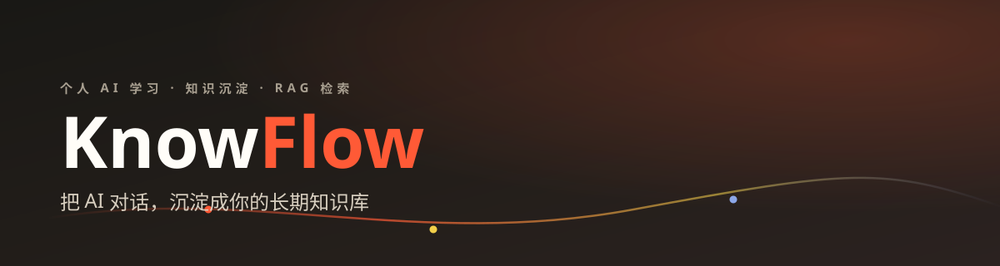
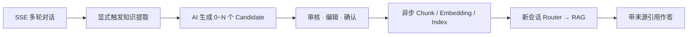
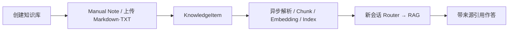
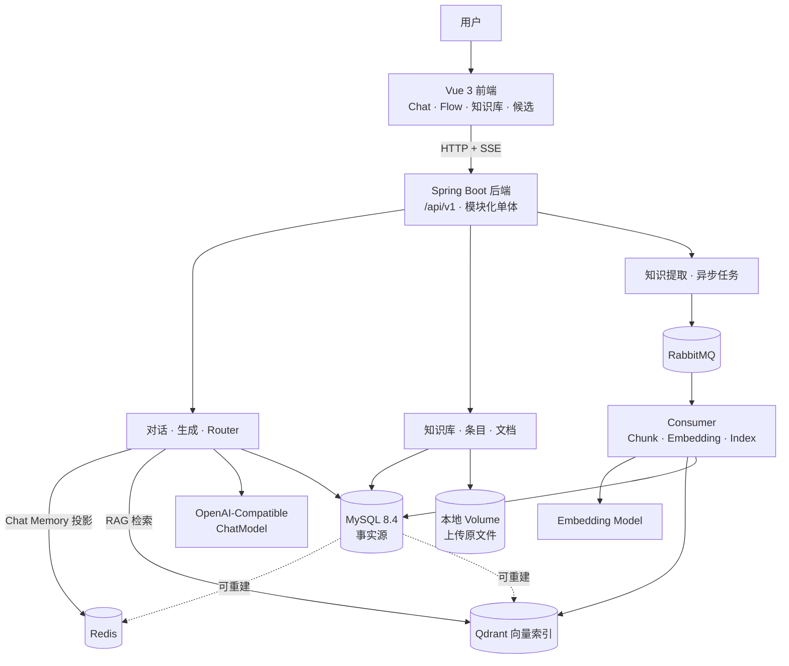

<div align="center">



> **个人 AI 学习与知识沉淀系统** —— 把日常 AI 对话、手动笔记与上传文档，统一沉淀为一份**可检索、可复用**的长期个人知识。

[📚 文档](#-文档) · [🚀 快速开始](#-快速开始) · [✨ 特性](#-核心特性) · [🏗 架构](#-架构) · [🧰 技术栈](#-技术栈) · [🗺 Roadmap](#-roadmap) · [🤝 贡献](#-贡献)

</div>

<p align="center">
**项目状态**


</p>

<p align="center">

**后端**


</p>

<p align="center">

**前端**


</p>

<p align="center">

**数据与中间件**


</p>

---

## ✨ 核心特性

**🗣 对话即沉淀** — SSE 多轮聊天后一键「提取知识」，AI 产出结构化草稿，**你审核、编辑、确认后才进入知识库**——聊天内容不会自动变成"知识垃圾场"。

**📝 笔记与文档统一入库** — 手动 Markdown 笔记 + 上传 `.md/.txt` 文件，与对话提取共用同一条 Chunk / Embedding / 索引流水线。

**🧭 智能路由 Router** — 新会话无需手动选知识库，Router 自动判断**是否需要检索**以及**命中哪些知识域**（0~N 个）。

**📚 RAG 带引用作答** — 检索到的知识作为上下文交给模型，回答带**编号来源**，可展开查看来源面板。

**🔌 多模型自由切换** — 任意 OpenAI-Compatible 模型（DeepSeek / Qwen / Ollama…），API Key **加密存储**、接口只返回掩码。

**⚙️ 异步任务与失败恢复** — RabbitMQ + Retry/DLQ + 幂等消费；MySQL 是**唯一事实源**，Redis / Qdrant 均可从事实数据重建。

**🧠 Redis 聊天记忆** — 多轮上下文记忆投影；Redis 故障时自动降级、从 MySQL 重建，不阻塞使用。

**🧪 零成本体验 + 可验证工程** — 内置模型 Stub，**无需任何 API Key** 即可跑通全链路；仓库级验证脚本 + Playwright E2E 双闭环验收。

---

## ♻️ 两个核心闭环

KnowFlow V1 的成功标准是以下两条真实前端闭环，均已通过 Playwright E2E 验收。

### 闭环一 · 对话沉淀



### 闭环二 · 个人笔记



### 核心概念

| 概念 | 说明 |
|---|---|
| **KnowledgeBase** | 逻辑知识域，相当于一个"文件夹"或"学科"，同一知识库下内容在聊天中可被检索。 |
| **KnowledgeItem** | 一条独立的知识条目，可来自对话提取、手写笔记或上传文件。 |
| **Candidate** | 对话中 AI 建议沉淀的知识草稿，需你审核、编辑后确认才成为 Item。 |
| **ModelConfig** | 云端 OpenAI-Compatible 文本模型配置（如 DeepSeek、Qwen），含 Base URL 与 API Key。 |
| **RAG** | 检索增强生成：提问时先检索相关 Item，再把上下文交给模型生成带引用的回答。 |

> 领域细节与状态机见 [docs/plans/DECISIONS.md](docs/plans/DECISIONS.md)。

---

## 🏗 架构

模块化单体：Vue SPA 与 Spring Boot 后端独立构建，MySQL 是业务事实源；Redis、RabbitMQ、Qdrant 与本地文件目录分别承担**可重建投影、异步投递、向量索引、原文件存储**。RabbitMQ 只承载异步 ProcessingTask 边界，不进入实时 Chat 主链路。



系统上下文与核心调用链见 [docs/architecture/system-context.md](docs/architecture/system-context.md)。

---

## 🧰 技术栈

| 层 | 技术 |
|---|---|
| 后端 | Java 21 · Spring Boot 4.1 · Spring AI 2.0 · Spring MVC + SSE · MyBatis-Plus · springdoc |
| 前端 | Vue 3 + TypeScript + Vite · Vue Router · Element Plus · markdown-it · Vitest · Playwright |
| 数据 | MySQL 8.4（事实源）· Redis 7（Chat Memory 投影）· RabbitMQ 3.13（异步任务）· Qdrant 1.12（向量索引） |
| 构建 | Maven Wrapper（后端）· npm（前端）· Docker Compose · GitHub Actions（`scripts/verify-all.sh`） |

---

## 🚀 快速开始

以下流程在本地完整跑通前端 + 后端 + 全部依赖。默认使用**本地模型 Stub**，**不需要任何真实 API Key** 即可体验全部功能。

### 环境要求

- Java 21
- Node.js 22+，npm 10+
- Docker + Docker Compose（MySQL、RabbitMQ、Qdrant；Redis 可选用 `redis:7`）

### 第一步 · 启动基础设施

```bash
cp .env.example .env

# 启动 MySQL、RabbitMQ、Qdrant
docker compose up -d mysql rabbitmq qdrant

# 主 Compose 未包含 Redis（Chat Memory 用），单独补起一个：
docker run -d --name knowflow-redis -p 6379:6379 redis:7
```

> **关于 Redis**：它是多轮对话记忆的投影层，缺失时后端自动降级、从 MySQL 重建，不会启动失败。不装也可正常体验，只是多轮记忆失效。

### 第二步 · 启动后端

```bash
# 生成并导出本地主密钥。请稳定保存在本机 Secret 管理方式中；
# 更换或丢失后，已保存的 ModelConfig API Key 将无法解密。
export KNOWFLOW_SECURITY_MASTER_KEY="$(openssl rand -base64 32)"

./knowflow-app/mvnw -f pom.xml -pl knowflow-app spring-boot:run
```

> `KNOWFLOW_SECURITY_MASTER_KEY` 是**唯一硬性必需**的环境变量，缺失时后端直接拒绝启动。注意 **Spring Boot 不会自动读取根目录 `.env`**，Compose 才会——上面的 `export` 不能省。

启动后确认健康：`http://localhost:8080/actuator/health` 与 `http://localhost:8080/api/v1/health`。

### 第三步 · 启动前端

```bash
cd frontend
npm install
npm run dev
```

前端开发服务器运行在 **http://localhost:5173**，`/api` 已代理到后端 8080，无需关心跨域。

### 第四步 · 零成本体验（本地 Stub 模式）

```bash
# 终端一：启动本地 OpenAI-Compatible 模型 Stub（Chat / Router / Embedding，固定 1024 维）
python3 scripts/model-stub.py

# 终端二：重启后端，允许连接 localhost 模型目标
export KNOWFLOW_MODEL_ALLOW_LOCAL_BASE_URL=true
./knowflow-app/mvnw -f pom.xml -pl knowflow-app spring-boot:run
```

然后在浏览器打开 http://localhost:5173：**模型设置**页创建 ModelConfig 指向 `http://127.0.0.1:18080/v1`，Embedding 配置填入 `KNOWFLOW_EMBEDDING_BASE_URL=http://127.0.0.1:18080/v1`（API Key 留空）。Stub 返回预设演示内容，用来验证 RAG 链路是否打通。

<details>
<summary>⚙️ 配置真实模型（DeepSeek / Qwen）</summary>

Stub 只能验证链路。要用真实模型对话与检索，需配置系统级 Embedding + 页面级 ChatModel。

**全局 Embedding（系统级）**：复制 `.env.example` 为 `.env` 并填入真实值：

```bash
KNOWFLOW_EMBEDDING_BASE_URL=https://dashscope.aliyuncs.com/compatible-mode/v1
KNOWFLOW_EMBEDDING_API_KEY=<你的 DashScope Key>
```

> Embedding 是单一系统级云端配置，不进入 ModelConfig 页面。留空时索引任务会因「Base URL 为空」失败并重试——真实使用必须提供。

**ChatModel（模型设置页面）**：

| 字段 | DeepSeek | Qwen |
|---|---|---|
| Provider | `DeepSeek` | `Qwen` |
| Base URL | `https://api.deepseek.com/v1` | `https://dashscope.aliyuncs.com/compatible-mode/v1` |
| Model Name | `deepseek-chat` | `qwen-plus` |
| temperature | `0.7` | `0.7` |
| maxOutputTokens | `2048` | `2048` |

API Key 在界面输入后加密保存，接口只返回掩码。Provider 兼容性说明见 [docs/development/provider-compatibility.md](docs/development/provider-compatibility.md)。

</details>

---

## 📁 项目结构

```text
knowflow-sanjin/
├── pom.xml               # Maven 聚合父工程与统一版本管理
├── knowflow-app/         # Spring Boot 后端（modules.common 分层）
├── frontend/             # Vue 3 + TypeScript 前端
├── docs/                 # 产品、架构、领域文档、ADR、设计系统与 Banner
├── eval/                 # AI/RAG 评估数据
├── scripts/              # 仓库级验证脚本（verify-fast / integration / e2e / all）
├── docker-compose.yml    # 单机基础设施编排
└── .env.example          # 环境变量示例（唯一允许提交的 env 文件）
```

后端 Java 包采用 `common + modules` 模块化结构，业务模块内区分 Controller / Service / Mapper / Entity / DTO / VO / Assembler / Exception。完整约定见 [docs/architecture/backend-package-structure.md](docs/architecture/backend-package-structure.md)。

---

## 🔌 API 一览

基础路径 `/api/v1`，BIGINT ID 统一为字符串，错误使用 Problem Details + 稳定 `errorCode` + `correlationId`。核心端点：

| 方法 | 路径 | 说明 |
|---|---|---|
| POST | `/api/v1/conversations/{id}/messages` | SSE 流式对话（`text/event-stream`） |
| POST | `/api/v1/conversations/{conversationId}/extraction` | 会话级知识提取 |
| POST | `/api/v1/candidates/{id}/confirm` | 确认候选 → KnowledgeItem |
| POST | `/api/v1/files` | 上传 Markdown/TXT（multipart） |
| GET | `/api/v1/knowledge-bases` | 知识库列表 |
| GET | `/api/v1/processing-tasks` | 异步任务状态 |
| PUT | `/api/v1/model-configs/{id}/disable` | 停用模型配置 |
| GET | `/api/v1/health` | 健康检查 |

完整契约见 [docs/api/openapi.json](docs/api/openapi.json)；前端通过 `npm run api:generate` 生成 TS 类型，`sh scripts/check-api-contract.sh` 检查运行时快照漂移。

---

## 📖 使用指南

### 主要访问路径

| 路径 | 页面 |
|---|---|
| `/flow` | 学习流主页 |
| `/chat` | 聊天工作台（SSE 流式 + 知识提取） |
| `/knowledge-bases` | 知识库管理 |
| `/documents/:id` | 知识文档详情 |
| `/candidates` | 对话提取候选审核 |
| `/processing` | 异步任务与索引状态 |
| `/model-settings` | 模型配置 |

<details>
<summary>🧪 双闭环自测（启动后建内容）</summary>

启动后数据库为空，需要先建内容。以下两条路径对应 V1 的两个核心闭环。

**闭环一 · 个人笔记 → RAG 检索**

1. **知识库**页创建知识库（如「个人知识管理」）；
2. **知识库详情**页新建一条 Manual Note，写一段有意义的内容，保存；
3. 等待右侧/任务状态显示**索引完成**（异步 Chunk + Embedding + 写入 Qdrant）；
4. 打开**新会话**，问一个和笔记内容相关的问题；
5. 回答中应出现**引用来源**（编号对应本次检索到的笔记），来源面板可见。

**闭环二 · 对话沉淀 → RAG 检索**

1. 在**模型设置**中确认已启用一个可用的 ChatModel（真实或 Stub 皆可）；
2. **聊天**页与 AI 多轮对话，聊到一个有沉淀价值的知识点；
3. 点击**提取知识**，等待 AI 产生 0～N 个 **Candidate**；
4. 在**候选**页审核、编辑，**确认**为 KnowledgeItem（也可拒绝）；
5. 等待异步索引完成，新会话中提问，应能检索到该知识点并带来源。

**一键整栈验证**：`sh scripts/verify-e2e.sh` 用隔离 Compose + 本地模型 Stub + Playwright 自动跑完两条闭环并建出演示内容，**不需要真实 Key**。

</details>

---

## ⚙️ 配置

配置通过根目录 `.env`（由 `.env.example` 复制而来）注入；`.env` 已被 Git 忽略。下表为完整变量清单：

<details>
<summary>📋 环境变量表（源自 .env.example）</summary>

| Variable | Required | 说明 | 默认值 |
|---|---|---|---|
| `KNOWFLOW_SECURITY_MASTER_KEY` | ✅ | 主密钥（Base64 AES-256），加密 ModelConfig 的 API Key | 无 |
| `KNOWFLOW_EMBEDDING_BASE_URL` | 真实使用 | 系统级 Embedding Base URL | 空 |
| `KNOWFLOW_EMBEDDING_API_KEY` | 真实使用 | Embedding API Key | 空 |
| `KNOWFLOW_EMBEDDING_MODEL` | 否 | Embedding 模型名 | `text-embedding-v4` |
| `KNOWFLOW_EMBEDDING_DIMENSIONS` | 否 | 向量维度 | `1024` |
| `MYSQL_HOST` / `MYSQL_PORT` | 否 | MySQL 地址 | `127.0.0.1` / `3306` |
| `MYSQL_DATABASE` / `MYSQL_USER` / `MYSQL_PASSWORD` | 否 | MySQL 库/账号（本地开发默认） | `knowflow` / `root` / `root` |
| `REDIS_HOST` / `REDIS_PORT` | 否 | Redis（Chat Memory 投影） | `127.0.0.1` / `6379` |
| `RABBITMQ_HOST` / `RABBITMQ_PORT` / `RABBITMQ_USER` / `RABBITMQ_PASSWORD` | 否 | RabbitMQ | `127.0.0.1` / `5672` / `guest` / `guest` |
| `QDRANT_URL` / `QDRANT_COLLECTION` | 否 | Qdrant | `http://127.0.0.1:6333` / `knowflow_dense_v1` |
| `APP_PORT` / `FRONTEND_PORT` | 否 | 端口 | `8080` / `5173` |
| `KNOWFLOW_DOCUMENT_STORAGE_ROOT` | 否 | 上传原文件目录 | `knowflow-data/files` |
| `KNOWFLOW_SECURITY_ENCRYPTION_VERSION` | 否 | 加密版本 | `1` |

</details>

---

## 🧪 测试与验证

仓库级验证入口以 `scripts/` 为事实源，GitHub Actions 也只调用它们：

```bash
sh scripts/verify-fast.sh             # 快速验证：编译、单元测试、typecheck、lint、format、build（无需 Docker）
sh scripts/verify-integration.sh      # MySQL/Redis/RabbitMQ/Qdrant Testcontainers 集成测试（需 Docker）
sh scripts/verify-e2e.sh              # 隔离基础设施 + Stub + Playwright 双闭环 E2E
sh scripts/verify-all.sh              # 完整验证组合（fast → secret scan → integration → e2e）
sh scripts/check-tracked-secrets.sh   # 扫描被跟踪/待跟踪文件的私钥、云 Key、token
sh scripts/check-api-contract.sh      # 后端运行时 OpenAPI 快照漂移检查
sh scripts/check-generated-api-types.sh  # 前端 generated API 类型与 OpenAPI 快照漂移检查
```

真实 Provider 冒烟（**不进入 CI**，需真实 Key）：`sh scripts/live-smoke.sh <Provider> <config-id>`、`sh scripts/embedding-smoke.sh`。

> `verify-fast.sh` 不要求 Docker；`verify-integration.sh` 需要 Docker。完整的测试原则见 [docs/development/testing.md](docs/development/testing.md)。

<details>
<summary>🧯 故障排查（FAQ）</summary>

| 症状 | 原因与解法 |
|---|---|
| 后端启动报 `KNOWFLOW_SECURITY_MASTER_KEY is not configured` | 未设置主密钥。运行 `export KNOWFLOW_SECURITY_MASTER_KEY="$(openssl rand -base64 32)"` 后再启动。 |
| `docker compose up` 提示卷路径不存在 | Compose 数据卷硬编码了本机路径，换机器需在 `docker-compose.yml` 中改成本机目录。 |
| 启动后端时连不上 MySQL/RabbitMQ/Qdrant | 确认先执行 `docker compose up -d mysql rabbitmq qdrant`，且端口未被占用。 |
| 聊天 / 检索报「模型 Base URL 为空」 | Embedding 或 ChatModel 未配置。真实 Key 见上方「配置真实模型」折叠块，Stub 见[零成本体验](#第四步-零成本体验本地-stub-模式)。 |
| RAG 没有检索到内容 | ① 提问前先确认已创建知识库与 Item，并等异步索引完成；② 提问内容与笔记相关性太弱；③ 没有可用 ChatModel/Embedding。 |
| 前端 `npm run dev` 后接口 404 | 确认后端已启动在 8080；前端 `/api` 已代理到 8080。 |
| 数据想重置 | MySQL 数据在 `docker compose down -v` 后清空；`-v` 会连同命名卷一并删除。 |

</details>

---

## 🗺 Roadmap

**✅ 已完成（V1）** —— 全部 Phase 0–9 已合入，双闭环通过真实前端 E2E 验收：

- [x] SSE 多轮对话 + Redis 聊天记忆
- [x] 多模型配置（OpenAI-Compatible），API Key 加密存储
- [x] 对话知识提取 → 候选审核 → 确认入知识库
- [x] 手动笔记 + Markdown/TXT 上传 + 异步索引
- [x] Knowledge Router 自动路由 + RAG 带引用作答
- [x] 本地模型 Stub 零成本体验
- [x] 仓库级验证脚本 + Playwright E2E + OpenAPI 契约检查

**🔭 规划中**（源自 [产品上下文](docs/product/knowflow-context.md) 的明确方向）：

- [ ] MCP Client / MCP Server（把个人知识暴露给 Codex / Claude Code 等 AI 工具）
- [ ] Single Agent + Tools / Skills
- [ ] Hybrid Search + Rerank / Query Rewrite
- [ ] Workflow / Graph 编排
- [ ] GraphRAG（研究方向）
- [ ] PDF / Word 富文档解析
- [ ] 多用户认证与安全加固（公网部署前置）

---

## 🔒 安全说明

- V1 为**单用户本地系统**，固定 System Owner `id=1`，不实现登录认证。
- 数据库凭据与应用主密钥通过环境变量注入；Provider API Key 在 ModelConfig 保存为认证密文。
- `.env` 已被 Git 忽略，且不会被 Spring Boot 自动读取；`.env.example` 是唯一允许提交的 env 示例文件。
- 所有业务数据与向量索引均保留 owner 边界。
- 无认证版本只能运行在 **localhost / 可信内网 / 已有外层保护**的环境，不能裸露公网。
- 禁止将密钥、证书或真实配置提交到仓库。

> 完整限制与公网部署前置条件见 [V1 已知限制与安全边界](docs/product/v1-known-limitations.md)。

---

## 📚 文档

- [KnowFlow V1 开发路线图](docs/plans/README.md) · [V1 决策基线](docs/plans/DECISIONS.md)
- [执行与 Review 工作流](docs/plans/WORKFLOW.md) · [产品范围](docs/product/v1-scope.md)
- [系统上下文](docs/architecture/system-context.md) · [领域模型与状态机](docs/architecture/domain-model-and-state-machines.md)
- [后端包结构](docs/architecture/backend-package-structure.md) · [设计系统](docs/design/design-system.md)
- [开发与测试指南](docs/development/testing.md) · [Provider 兼容性](docs/development/provider-compatibility.md)

---

## 🤝 贡献

1. 开始前阅读 [AGENTS.md](AGENTS.md) / [CLAUDE.md](CLAUDE.md) 与 [执行与 Review 工作流](docs/plans/WORKFLOW.md)。
2. 遵守 Phase 规划：先读 `docs/plans/README.md` 与当前 Phase 的 `PLAN.md` / `REVIEW.md`。
3. 提交前运行 `sh scripts/verify-fast.sh`（编译、单元测试、typecheck、lint、build，无需 Docker）；全量验证运行 `sh scripts/verify-all.sh`。
4. 明确任务边界、保留用户已有修改，遵循仓库 `docs/plans/DECISIONS.md` 的决策优先级。

---

<div align="center">

**KnowFlow** · 把 AI 对话，沉淀成你的长期知识库

<sub>未指定开源 License · All rights reserved · 仅限 localhost / 可信内网运行</sub>

</div>
